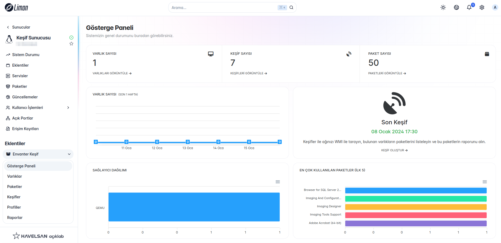
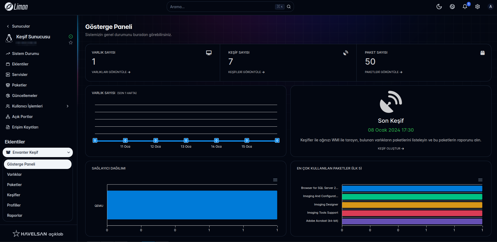

## Inventory Server
<p float="left">
  
   
   
  
</p>

----
This service aims to scan the network with WMI, list the packages of the found machines, and get a report of these packages.

It currently supports postgresql, mysql and sqlite databases as storage.

### Deployment
----
Depending on your request, the relevant package is downloaded from the [link here](https://github.com/limanmys/inventory-server/releases).

For Debian based systems:

```
sudo apt install ./inventory-server-{{release.number}}-x64.deb
```

For RHEL based systems:

```
sudo yum install ./inventory-server-{{release.number}}-x64.rpm
```

After installation, you should create a database and user on your database server.

Example for postgresql,

```
sudo -u postgres psql

postgres=# CREATE USER inventory WITH PASSWORD '****';
postgres=# CREATE DATABASE inventory WITH OWNER inventory;
postgres=# \q
```

The environment file is filled with appropriate data.

```
sudo nano /opt/inventory-server/.env
```

The content should look like the following :

```
DB_DRIVER=postgres/mysql/sqlite # Database type
DB_HOST=10.1.1.1 # Database ip address
DB_PORT=5432/3306 # Database port
DB_NAME=inventory # Database name 
DB_USER=inventory # Database username
DB_PASS= # Database user's password
REPORT_ENGINE_URL=localhost:8001 # Report engine URL. 
```

For Report Engine [see here](https://github.com/limanmys/fastapi-report-engine).

Finally, the service must be restarted.

```
sudo systemctl restart inventory-server@admin
```

To make sure it works correctly :

```
sudo systemctl status inventory-server@admin
```

### Frontend App (Liman) [see here](https://github.com/limanmys/liman-inventory).




